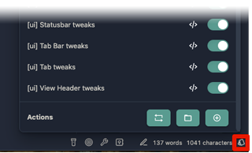

# Replete's Obsidian CSS snippets for Minimal Theme


This is my working folder of CSS snippets for Obsidian using [@kepano](https://github.com/kepan)'s [Minimal Theme](https://github.com/kepano/obsidian-minimal). There are opinionated tweaks and fixes for various plugins and aspects of Obsidian's UI organized into separate CSS files.

## My environment


- `MacOS 13.x`, ~~Mobile~~ 
- `Obsidian v1.1.19` (official Installer, homebrew unreliable)
- `Minimal Theme v6.2.3`
- Enabled plugins: `['templater-obsidian', 'dataview', 'calendar', 'settings-search', 'cmdr', 'periodic-notes', 'heatmap-calendar', 'obsidian-hide-sidebars-when-narrow', 'hotkeysplus-obsidian', 'obsidian-minimal-settings', 'obsidian-custom-frames', 'obsidian-attachment-name-formatting', 'open-vscode', 'obsidian-full-calendar', 'quickadd', 'metadata-menu', 'mysnippets-plugin', 'obsidian-day-planner', 'dbfolder', 'obsidian-tagfolder', 'no-dupe-leaves', 'cm-editor-syntax-highlight-obsidian', 'obsidian-toggle-list', 'custom-sort', 'obsidian-icon-folder', 'omnisearch', 'obsidian-tabs', 'obsidian-task-progress-bar', 'obsidian-hotkeys-for-specific-files', 'table-editor-obsidian', 'obsidian-advanced-uri', 'auto-class', 'obsidian-checklist-plugin', 'obsidian-contextual-typography', 'code-block-copy', 'make-md', 'obsidian-kanban', 'nldates-obsidian']`
```js
[...new Set(app.plugins.enabledPlugins)]
```

## How to use

1. Clone/[fork](https://github.com/replete/obsidian-minimal-theme-css-snippets/fork)/[unzip](https://github.com/replete/obsidian-minimal-theme-css-snippets/archive/refs/heads/main.zip) into `<your vault location>/.obsidian/snippets` and make changes as needed
2. Dupe existing files and modify to your requirements
3. Install the `MySnippets` community plugin by [@chetachiezikeuzor](https://github.com/chetachiezikeuzor) and activate snippets individually


## Someday/maybe
- [ ] Test/fix for Mobile Obsidian (likely near future)
- [ ] Test/fix for Windows or Linux (less likely)

## Versions / updates

I use Obsidian every day so if something breaks I am likely to fix it - but there are no promises it will happen immediately. If a new Obsidian version comes along and breaks evrything, I might keep using the older version until plugins get updated, and then migrate fixes to the new version.

Obsidian is that it is a commercial product still in heavy development and things will inevitably break. Some popular features only exist within complex configurations of discrete open source extensions to the core product, varied in quality and orchestration. This repository is for other hackers, it's all a stop gap and I cannot make wide promises of support, but because I'm using it every day I'm likely to make improvements.

If a new version is released, I will tag the repo at the last version (e.g. `v1.1.18`, and commits after that will be for the next version (e.g. 'v1.1.19'). I'll update my plugins regularly so fixes will come as and when as new commits.

<a href="https://www.buymeacoffee.com/replete"></a>